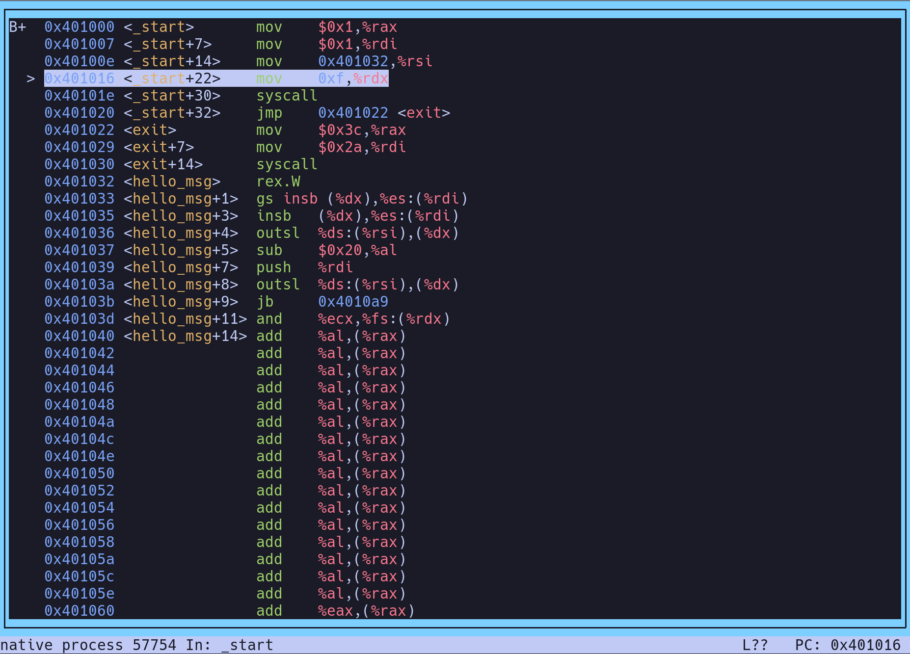

# Syscall

YouTube: [System calls at the assembly level](https://youtu.be/UW7a1n3VEFg) by Artem Pianykh

Linux `.S`: AT&T Style Assembly

## Interrupt

Interrupt handling has a lot of overhead.

[interrupt.S](interrupt.S)

### Build

```bash
as -32 interrupt.S -o interrupt.o;
ld --static -melf_i386 interrupt.o -o interrupt;
./interrupt
echo $? # 42
```

### Ref

#### entry_64_compat.S

- [arch/x86/entry/entry_64_compat.S](https://github.com/torvalds/linux/blob/master/arch/x86/entry/entry_64_compat.S)

```asm
/*
 * Arguments:
 * eax  system call number
 * ebx  arg1
 * ecx  arg2
 * edx  arg3
 * esi  arg4
 * edi  arg5
 * ebp  user stack
 * 0(%ebp) arg6
 */
```

#### syscall_32.tbl

- [arch/x86/entry/syscalls/syscall_32.tbl](https://github.com/torvalds/linux/blob/master/arch/x86/entry/syscalls/syscall_32.tbl)

```asm
1	i386	exit			sys_exit
```

---

## Register

[register.S](register.S)

### Build

```bash
as register.S -o register.o;
ld --static register.o -o register;
./register
echo $? # 42
```

### Ref

#### AMD64

[AMD64 Architecture Manual](https://www.amd.com/en/support/tech-docs/amd64-architecture-programmers-manual-volumes-1-5)

```txt
6.1.1 SYSCALL and SYSRET

SYSCALL and SYSRET Instructions. SYSCALL and SYSRET are low-latency system call and return instructions. These instructions assume the operating system implements a flat-memory model, which greatly simplifies calls to and returns from the operating system. This simplification comes from eliminating unneeded checks, and by loading pre-determined values into the CS and SS segment registers (both visible and hidden portions). As a result, SYSCALL and SYSRET can take fewer than one-fourth the number of internal clock cycles to complete than the legacy CALL and RET instructions. SYSCALL and SYSRET are particularly well-suited for use in 64-bit mode, which requires implementation of a paged, flat-memory model. 
```

#### syscall_64.tbl

- [arch/x86/entry/syscalls/syscall_64.tbl](https://github.com/torvalds/linux/blob/master/arch/x86/entry/syscalls/syscall_64.tbl)

```asm
60	common	exit			sys_exit
```

#### entry_64.S

- [arch/x86/entry/entry_64.S](https://github.com/torvalds/linux/blob/master/arch/x86/entry/entry_64.S)

```asm
/*
 * Registers on entry:
 * rax  system call number
 * rcx  return address
 * r11  saved rflags (note: r11 is callee-clobbered register in C ABI)
 * rdi  arg0
 * rsi  arg1
 * rdx  arg2
 * r10  arg3 (needs to be moved to rcx to conform to C ABI)
 * r8   arg4
 * r9   arg5
 * (note: r12-r15, rbp, rbx are callee-preserved in C ABI)
 */
```

---

## Hello

[hello.S](hello.S)

### Build

```asm
_start:
  mov $1, %rax
  mov $1, %rdi
  mov hello_msg, %rsi
  mov hello_msg_len, %rdx
  syscall
  jmp exit

exit:
  mov $60, %rax # system call number: sys_exit(60)
  mov $42, %rdi # return code
  syscall

hello_msg:
  .string "Hello, World!\n"

hello_msg_len = . - hello_msg
```

```bash
as hello.S -o hello.o;
ld --static hello.o -o hello;
./hello

[1]    57445 segmentation fault (core dumped)  ./hello
```

### Ref

#### Write

```bash
man 2 write
```

```c
#include <unistd.h>

ssize_t write(int fd, const void *buf, size_t count);
```

#### syscall_64.tbl

- [arch/x86/entry/syscalls/syscall_64.tbl](https://github.com/torvalds/linux/blob/master/arch/x86/entry/syscalls/syscall_64.tbl)

```asm
1	common	write			sys_write
```

#### entry_64.S

- [arch/x86/entry/entry_64.S](https://github.com/torvalds/linux/blob/master/arch/x86/entry/entry_64.S)

```asm
/*
 * Registers on entry:
 * rax  system call number
 * rcx  return address
 * r11  saved rflags (note: r11 is callee-clobbered register in C ABI)
 * rdi  arg0
 * rsi  arg1
 * rdx  arg2
 * r10  arg3 (needs to be moved to rcx to conform to C ABI)
 * r8   arg4
 * r9   arg5
 * (note: r12-r15, rbp, rbx are callee-preserved in C ABI)
 */
```

### Debug

```bash
gdb hello

(gdb) b _start
Breakpoint 1 at 0x401000
(gdb) layout asm
(gdb) r # run
(gdb) s # step 
(gdb) q # quit
```



```asm
mov 0xf,%rdx
```

- wrong: memory `0xf` → `%rdx`
- should be: `$0xf`

#### Rewrite

```asm
_start:
  mov $1, %rax
  mov $1, %rdi
  mov $hello_msg, %rsi
  mov $hello_msg_len, %rdx
  syscall
  jmp exit
```

#### Rerun

```bash
as hello.S -o hello.o;
ld --static hello.o -o hello;
```

```bash
./hello

Hello, World!
```

```bash
echo $?

42
```

---

## C language

[hello.c](hello.c)

### Build

```bash
cc hello.c -o helloc
```

```bash
./helloc

Hello, World!
```

```bash
echo $?

42
```

### Ref

#### Syscall

```bash
man 2 syscall
```

```c
#include <unistd.h>
#include <sys/syscall.h>   /* For SYS_xxx definitions */

long syscall(long number, ...);
```

#### strlen

```bash
man 3 strlen
```

```c
#include <string.h>

size_t s  trlen(const char *s);
```
